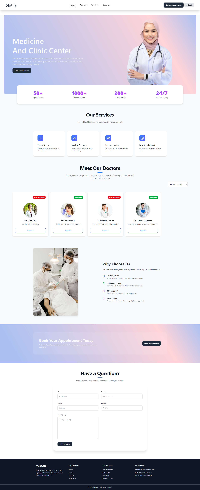
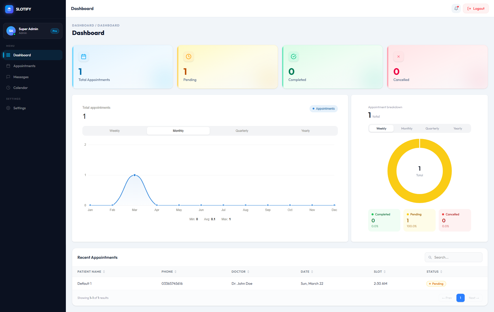
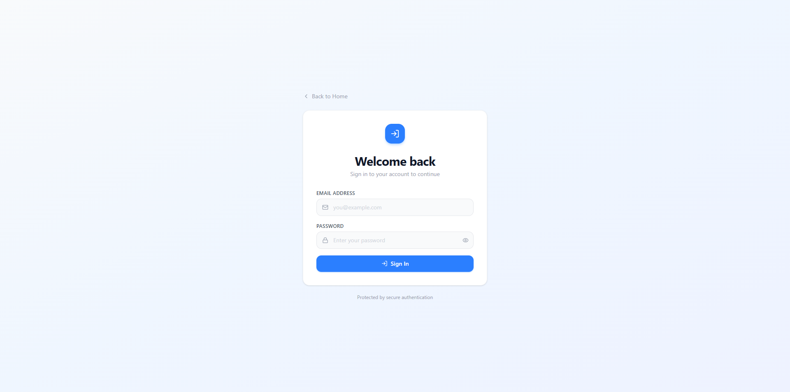
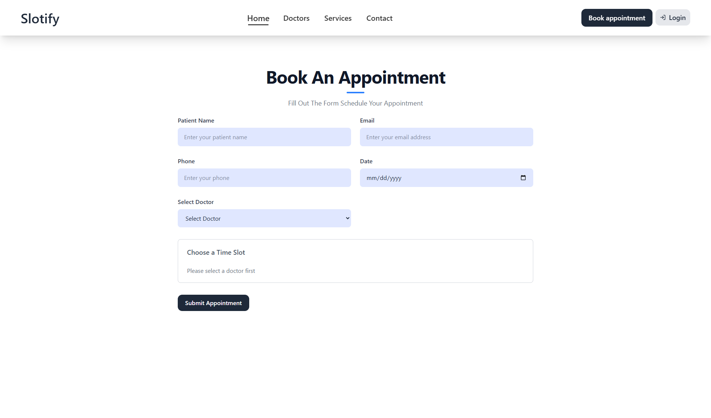
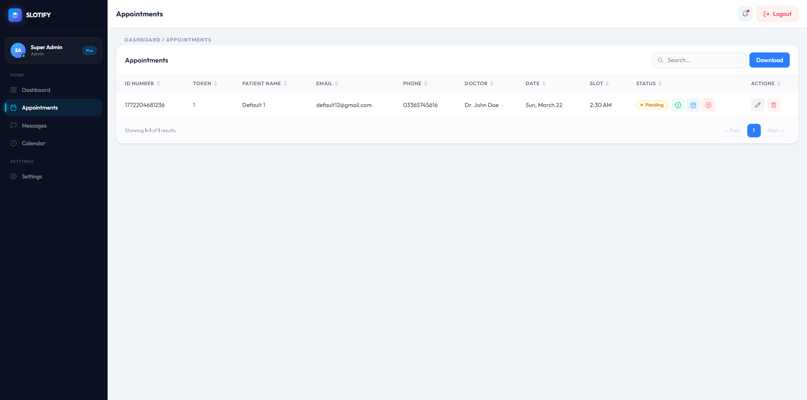
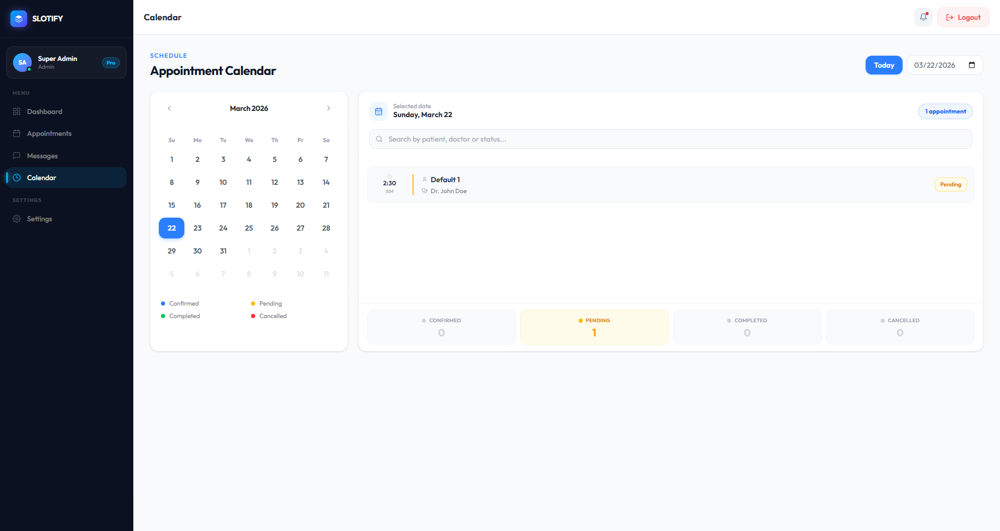

# 🗓️ Slotify — Appointment Booking & Management System

A fully responsive appointment booking and management system built with React.js. Features a complete frontend workflow — authentication, dashboard analytics, CRUD operations, WhatsApp integration, and Excel export.

🔗 [Live Demo](https://abrorizwan1.github.io/appointment-management-system/) · [GitHub](https://github.com/AbroRizwan1/appointment-managment-system)

---

## 📸 Screenshots

| Landing Page | Dashboard |
|---|---|
|  |  |

| Login | Appointments |
|---|---|
|  |  |

| Table | Calendar |
|---|---|
|  |  |

---

## ✨ Features

**🌐 Landing Page**
- Fully responsive modern UI
- Smooth navigation & clean section layout

**🔐 Authentication**
- Login with protected dashboard routes
- Persistent session via LocalStorage

**📊 Dashboard**
- View appointments & queries
- Search functionality & data management

**📅 Appointment Management**
- Add, edit, delete & undo appointments
- Confirm & cancel with status tracking
- Auto-generated WhatsApp messages on confirm/cancel

**📤 Data Export**
- Download appointment data as Excel (.xlsx)

**💬 WhatsApp Integration**
- One-click WhatsApp chat with pre-filled message

---

## 🛠️ Tech Stack

| Technology | Purpose |
|---|---|
| React.js | UI & component architecture |
| React Router DOM | Navigation & protected routes |
| Tailwind CSS | Styling & responsive design |
| XLSX | Excel export |
| LocalStorage | Data persistence |
| WhatsApp Web API | Direct chat redirection |

---

## 🚀 Getting Started

### 1 — Clone the repo
```bash
git clone https://github.com/AbroRizwan1/appointment-managment-system.git
cd appointment-managment-system
```

### 2 — Install dependencies
```bash
npm install
```

### 3 — Run locally
```bash
npm run dev
```

### 4 — Build for production
```bash
npm run build
```

---

## 🎯 Key Highlights

- React routing with fully protected dashboard routes
- Complete CRUD with undo delete functionality
- Real-time form validation & state management
- Excel export & WhatsApp integration
- Professional dashboard UI with analytics charts

---

## 👨‍💻 Author

**Rizwan Abro** — Frontend Developer (React)

## 📄 License
Open source — for educational and portfolio purposes.